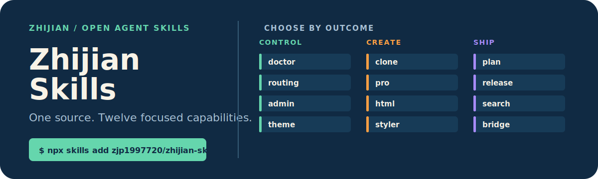

# Zhijian Skills

<p align="center">
  
</p>

<p align="center"><strong>Install focused Agent Skills from one trusted source, with complete payloads and independently verified releases.</strong></p>

<p align="center">
  <a href="./README.zh-CN.md">简体中文</a> ·
  <a href="#choose-a-skill">Browse the catalog</a> ·
  <a href="./CONTRIBUTING.md">Contribute</a>
</p>

Zhijian Skills is the canonical source for eight focused Agent Skills spanning Codex operations, knowledge systems, research, information design, and publishing.

## Start in 30 seconds

List all eight Skills:

```bash
npx skills add zjp1997720/zhijian-skills --list
```

Install only what you need:

```bash
npx skills add zjp1997720/zhijian-skills --skill wechat-styler
```

Install globally for a specific Harness:

```bash
npx skills add zjp1997720/zhijian-skills \
  --skill codex-model-routing-team --agent codex --global --copy --yes
```

> Existing standalone repositories remain available as generated compatibility mirrors. New Issues and contributions belong in this canonical repository.

## Choose a Skill

| Area | Skill | Result | Documentation |
| --- | --- | --- | --- |
| Codex control | [`codex-doctor`](docs/skills/codex-doctor/README.md) | Diagnose context, configuration, and workspace drift without changing files | [Docs](docs/skills/codex-doctor/README.md) |
| Codex control | [`codex-model-routing-team`](docs/skills/codex-model-routing-team/README.md) | Route bounded background tasks to explicit models and reasoning levels | [Docs](docs/skills/codex-model-routing-team/README.md) |
| Codex control | [`codex-skill-admin`](docs/skills/codex-skill-admin/README.md) | Audit, disable, restore, and verify local Codex Skills | [Docs](docs/skills/codex-skill-admin/README.md) |
| Knowledge systems | [`enterprise-clone-builder`](docs/skills/enterprise-clone-builder/README.md) | Build a structured enterprise digital-twin repository from evidence | [Docs](docs/skills/enterprise-clone-builder/README.md) |
| Information design | [`html-express`](docs/skills/html-express/README.md) | Turn dense material into a clear, self-contained HTML report | [Docs](docs/skills/html-express/README.md) |
| Release governance | [`skill-open-sourcer`](docs/skills/skill-open-sourcer/README.md) | Audit, package, document, verify, and publish Agent Skills | [Docs](docs/skills/skill-open-sourcer/README.md) |
| Content research | [`wechat-article-search`](docs/skills/wechat-article-search/README.md) | Discover WeChat public-account articles as structured JSON | [Docs](docs/skills/wechat-article-search/README.md) |
| Editorial publishing | [`wechat-styler`](docs/skills/wechat-styler/README.md) | Convert Markdown into polished, WeChat-compatible inline HTML | [Docs](docs/skills/wechat-styler/README.md) |

## Why one Portfolio

- **One editable source.** Every public Skill is maintained on `main` in this repository.
- **Complete installation units.** Supporting scripts, references, themes, and assets travel with each Skill.
- **Independent releases.** Every Skill owns its version, Changelog, Tag, tests, and standalone compatibility mirror.

`codex-model-routing-team` can be invoked explicitly. Its documentation also includes an optional `AGENTS.md` authorization block for automatic activation on complex parallel work.

## Repository model

```text
skills/<name>/          complete agent-facing install payload
docs/skills/<name>/     human-facing English and Chinese documentation
registry/skills.json    versions, mirrors, validation, and Harness support
assets/readme/          Portfolio identity assets
```

Standalone repositories are generated from this source through normal commits. Their history and old install URLs remain available, while source changes and community work stay centralized here.

## Contribution and license

Read [CONTRIBUTING.md](CONTRIBUTING.md) before opening an Issue or pull request. The Portfolio is released under the [MIT License](LICENSE); bundled Skill notices remain with their respective payloads.
