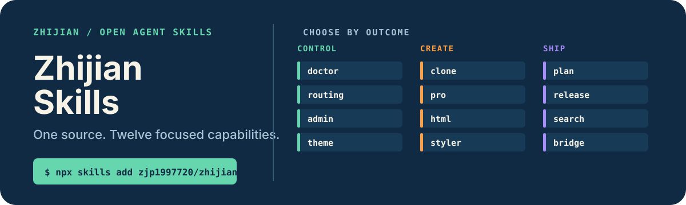

# Zhijian Skills

<p align="center">
  
</p>

<p align="center"><strong>Install focused Agent Skills from one trusted source, with complete payloads and independently verified releases.</strong></p>

<p align="center">
  <a href="./README.zh-CN.md">简体中文</a> ·
  <a href="#choose-a-skill">Browse the catalog</a> ·
  <a href="./CONTRIBUTING.md">Contribute</a>
</p>

Zhijian Skills is the canonical source for nineteen focused Agent Skills spanning Codex operations and experience, workflow orchestration, model reasoning and infrastructure, knowledge systems, research, information design, and publishing.

## Start in 30 seconds

List all nineteen Skills:

```bash
npx skills add zjp1997720/zhijian-skills --list
```

Install only what you need:

```bash
npx skills add zjp1997720/zhijian-skills --skill wechat-styler
```

Install globally for a specific Harness:

```bash
npx skills add zjp1997720/zhijian-skills \
  --skill codex-model-routing-team --agent codex --global --copy --yes
```

> This is the only publishing repository. New Skills, releases, Issues, and contributions all belong here.

## Choose a Skill

| Area | Skill | Result | Documentation |
| --- | --- | --- | --- |
| Model infrastructure | [`codex-cli-model-bridge`](docs/skills/codex-cli-model-bridge/README.md) | Add verified loopback models to Codex without hiding ChatGPT history | [Docs](docs/skills/codex-cli-model-bridge/README.md) |
| Codex control | [`codex-doctor`](docs/skills/codex-doctor/README.md) | Diagnose context, configuration, and workspace drift without changing files | [Docs](docs/skills/codex-doctor/README.md) |
| Cross-agent handoff | [`codex-external-handoff`](docs/skills/codex-external-handoff/README.md) | Launch and supervise persistent Codex App Server threads from WorkBuddy or Claude Code | [Docs](docs/skills/codex-external-handoff/README.md) |
| Codex control | [`codex-handoff`](docs/skills/codex-handoff/README.md) | Continue an oversized or slow Codex task in a fresh task with compact context | [Docs](docs/skills/codex-handoff/README.md) |
| Image generation | [`codex-image-gen`](docs/skills/codex-image-gen/README.md) | Reuse the logged-in Codex CLI OAuth state to generate and edit images without an API key | [Docs](docs/skills/codex-image-gen/README.md) |
| Codex control | [`codex-model-routing-team`](docs/skills/codex-model-routing-team/README.md) | Compile parallel work into TeamPlans; use Sol Medium execution and risk-based routing | [Docs](docs/skills/codex-model-routing-team/README.md) |
| Codex control | [`codex-skill-admin`](docs/skills/codex-skill-admin/README.md) | Audit, disable, restore, and verify local Codex Skills | [Docs](docs/skills/codex-skill-admin/README.md) |
| Codex experience | [`codex-theme-studio`](docs/skills/codex-theme-studio/README.md) | Build reversible macOS Codex themes from safe variables, custom artwork, or bundled presets | [Docs](docs/skills/codex-theme-studio/README.md) |
| Knowledge systems | [`enterprise-clone-builder`](docs/skills/enterprise-clone-builder/README.md) | Build a structured enterprise digital-twin repository from evidence | [Docs](docs/skills/enterprise-clone-builder/README.md) |
| Model reasoning | [`gpt56-sol-pro-consult`](docs/skills/gpt56-sol-pro-consult/README.md) | Get a file-grounded, model-verified GPT 5.6 Sol Pro second opinion through Codex Chrome | [Docs](docs/skills/gpt56-sol-pro-consult/README.md) |
| Information design | [`html-express`](docs/skills/html-express/README.md) | Turn dense material into a clear, self-contained HTML report | [Docs](docs/skills/html-express/README.md) |
| Long-form writing | [`leadbook`](docs/skills/leadbook/README.md) | Produce evidence-backed Chinese business books and white papers with auditable quality gates | [Docs](docs/skills/leadbook/README.md) |
| Workflow orchestration | [`light-plan-and-work`](docs/skills/light-plan-and-work/README.md) | Plan bounded work briefly, execute immediately, and escalate only on heavy conditions | [Docs](docs/skills/light-plan-and-work/README.md) |
| Release governance | [`skill-open-sourcer`](docs/skills/skill-open-sourcer/README.md) | Audit, package, document, verify, and publish Agent Skills | [Docs](docs/skills/skill-open-sourcer/README.md) |
| Content research | [`wechat-article-search`](docs/skills/wechat-article-search/README.md) | Discover WeChat public-account articles as structured JSON | [Docs](docs/skills/wechat-article-search/README.md) |
| Editorial publishing | [`wechat-styler`](docs/skills/wechat-styler/README.md) | Convert Markdown into polished, WeChat-compatible inline HTML | [Docs](docs/skills/wechat-styler/README.md) |
| Content archiving | [`web-clipper`](docs/skills/web-clipper/README.md) | Save public article URLs and bounded archive pages as structured Markdown | [Docs](docs/skills/web-clipper/README.md) |
| Model infrastructure | [`workbuddy-cli-model-bridge`](docs/skills/workbuddy-cli-model-bridge/README.md) | Connect verified CLI subscription models to WorkBuddy through a loopback proxy | [Docs](docs/skills/workbuddy-cli-model-bridge/README.md) |
| Content archiving | [`wxmp-article-harvester`](docs/skills/wxmp-article-harvester/README.md) | Export a public WeChat account into verified Markdown, indexes, and a completion report | [Docs](docs/skills/wxmp-article-harvester/README.md) |

## Why one Portfolio

- **One editable source.** Every public Skill is maintained on `main` in this repository.
- **Complete installation units.** Supporting scripts, references, themes, and assets travel with each Skill.
- **Independent versions, one repository.** Every Skill owns its version, Changelog, canonical Tag, and tests while sharing this publishing source.

`codex-model-routing-team` can be invoked explicitly. Its documentation also includes an optional `AGENTS.md` authorization block for automatic activation when parallel execution has a clear net benefit.

## Repository model

```text
skills/<name>/          complete agent-facing install payload
docs/skills/<name>/     human-facing English and Chinese documentation
registry/skills.json    versions, validation, capabilities, and Harness support
assets/readme/          Portfolio identity assets
```

Every install and release resolves through this repository. The Portfolio does not create or synchronize standalone Skill repositories.

## Contribution and license

Read [CONTRIBUTING.md](CONTRIBUTING.md) before opening an Issue or pull request. The Portfolio is released under the [MIT License](LICENSE); bundled Skill notices remain with their respective payloads.
