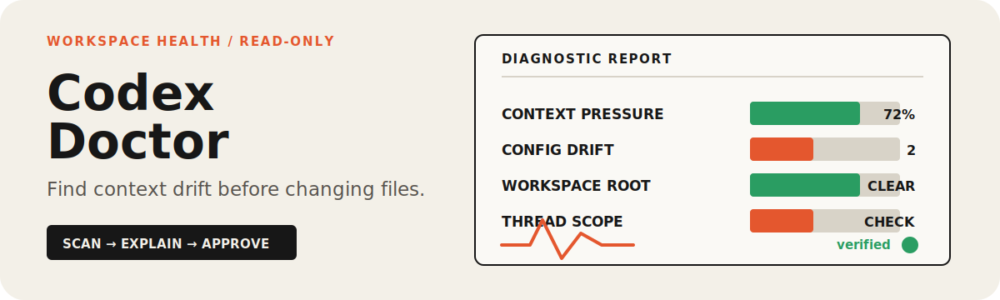

# Codex Doctor

<p align="center">
  
</p>

<p align="center"><strong>Audit Codex installation health and workspace context quality without changing local files.</strong></p>

<p align="center"><a href="./README.zh-CN.md">简体中文</a> · <a href="https://github.com/zjp1997720/zhijian-skills/tree/main/skills/codex-doctor">Canonical source</a></p>

Run it when Codex behaves inconsistently and you need evidence before changing configuration or workspace files.

## Agent Install

```bash
npx skills add zjp1997720/zhijian-skills -g -a codex --skill codex-doctor -y
```

Then invoke `$codex-doctor`, or ask Codex to run a workspace health check.

> Codex does not currently register this Skill as a slash command in the command palette. Use `$codex-doctor` or natural language instead of typing `/doctor`.

## Why This Exists

Long-lived agent workspaces accumulate instructions, Skills, MCP servers, hooks, configuration, and generated files. Over time, rules can exceed the effective context limit, duplicate each other, point to missing commands, or bury the instructions that actually matter.

Claude Code turned `/doctor` into a full setup checkup in [v2.1.205](https://github.com/anthropics/claude-code/releases/tag/v2.1.205), then added checks for repository-inferable `CLAUDE.md` content in [v2.1.206](https://github.com/anthropics/claude-code/releases/tag/v2.1.206). Codex Doctor brings the same general idea to Codex while preserving Codex-native concepts such as `AGENTS.md`, Skills, MCP, hooks, and `codex doctor --json`.

## Requirements

- Codex CLI with `codex doctor --json`
- Python 3.11 or newer
- Git
- macOS or Linux

The scanner uses only the Python standard library.

## What It Does

- Combines Codex's built-in runtime report with deterministic, read-only workspace checks.
- Audits the effective `AGENTS.md` chain, context-size pressure, exact duplication, Skills, MCP, hooks, config, Git state, and repository-root hygiene.
- Separates machine-verifiable findings from semantic cleanup candidates, then requires finding-level approval before any repair.

It does not execute hooks, expose secret values, delete rules, disable extensions, update Codex, change permissions, or repair files automatically.

## How It Works

Codex Doctor uses four layers:

1. **Native diagnostics** — consumes `codex doctor --json` instead of reimplementing Codex runtime checks.
2. **Deterministic scanner** — gathers redacted evidence about workspace configuration and context governance.
3. **Model judgment** — distinguishes disposable inventory from business facts, safety boundaries, brand voice, Git rules, and directory contracts.
4. **Controlled repair** — when explicitly requested, presents one finding and one file diff at a time, verifies the source SHA-256, applies only the approved change, and reruns the relevant check.

This split matters: a script can prove that two blocks are identical, but it cannot safely decide whether that repetition is an intentional cross-host contract.

## Example Requests

```text
Use $codex-doctor to run a complete health check. Diagnose only and do not change files.

Use $codex-doctor to find why Codex keeps ignoring this project's AGENTS.md.

Use $codex-doctor to audit broken or low-value Skills, MCP servers, and hooks. Show evidence before proposing changes.
```

The bundled scanner can also be run directly:

```bash
python3 scripts/scan_workspace.py --cwd /path/to/project --compact-json
```

## Safety Model

Diagnosis is read-only. Severity never grants repair permission.

Semantic deletion, configuration changes, enabling or disabling components, and file moves require an explicit finding-level approval. Secret-shaped values are reported by location and key only; their values are redacted.

See the canonical [checks and repair policy](https://github.com/zjp1997720/zhijian-skills/blob/main/skills/codex-doctor/references/checks-and-repair-policy.md) for the complete evidence, approval, concurrency, and verification gates.

## Repository Layout

```text
.
├── SKILL.md
├── agents/openai.yaml
├── references/checks-and-repair-policy.md
├── scripts/scan_workspace.py
├── tests/test_scan_workspace.py
└── evals/evals.json
```

## Development

```bash
python3 -m unittest discover -s tests -v
python3 scripts/scan_workspace.py --cwd /path/to/project --compact-json
```

The test suite covers instruction scope and truncation, redaction, MCP and hook validation, Git hygiene, compact-report integrity, and repair-safety assumptions.

## License

[MIT](LICENSE)
