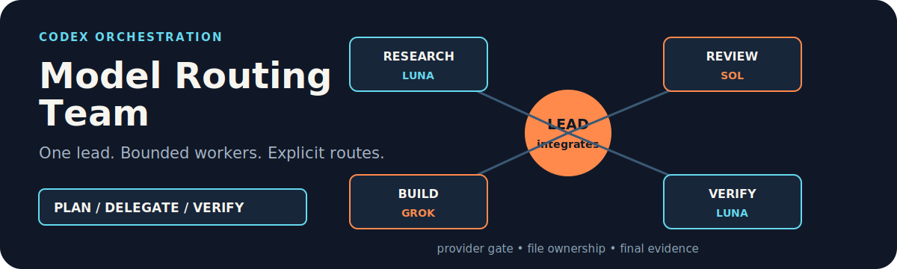

# Codex Model Routing Team

<p align="center">
  
</p>

<p align="center"><strong>Give Codex a bounded team of model-routed background tasks while one lead keeps control of planning, integration, and verification.</strong></p>

<p align="center"><a href="./README.zh-CN.md">简体中文</a> · <a href="https://github.com/zjp1997720/zhijian-skills/tree/main/skills/codex-model-routing-team">Canonical source</a></p>

Use it for complex parallel work when one lead Agent should plan and integrate while bounded background tasks run on explicitly chosen models.

## Install

The standard `skills` CLI shorthand is valid:

```bash
npx skills add zjp1997720/zhijian-skills
```

For a global Codex installation without symlinks:

```bash
npx skills add zjp1997720/zhijian-skills \
  -g -a codex --skill codex-model-routing-team --copy -y
```

The full canonical GitHub URL works too:

```bash
npx skills add https://github.com/zjp1997720/zhijian-skills \
  -g -a codex --skill codex-model-routing-team --copy -y
```

Verify that the installed package contains both the entrypoint and its supporting policies:

```bash
npx skills ls -g -a codex
find ~/.agents/skills/codex-model-routing-team -maxdepth 2 -type f | sort
```

The file list must include `SKILL.md`, `references/model-registry.json`, `references/audit-schema.json`, `references/routing-policy.md`, `references/provider-policy.md`, `references/recovery-policy.md`, `references/task-packet.md`, `references/thread-lifecycle.md`, `scripts/model_preflight.py`, and `scripts/validate_route_plan.py`. If only `SKILL.md` appears, remove that incomplete installation and install the current release again.

## Activate it

Explicit activation works immediately after installation:

```text
Use $codex-model-routing-team to research these six independent topics in parallel, then verify and synthesize the findings.
```

To let Codex activate the Skill automatically for suitable complex work, add the following standing authorization to `~/.codex/AGENTS.md`. Put it in a project-level `AGENTS.md` instead when the authorization should apply only to that project.

```markdown
## Codex background model-routing authorization

- The user authorizes Codex to use `$codex-model-routing-team` automatically for complex, parallelizable tasks, create independent background tasks, and assign a model and reasoning level to each task. Before dispatch, briefly state the number of tasks, model, reasoning level, and responsibility. No additional confirmation is required.
- The lead agent keeps its current model and owns planning, file ownership, integration, verification, and final delivery.
- Run at most 6 background tasks concurrently and make at most 8 creation attempts for one root task; failures, non-materialized calls, and fallbacks count. Background tasks must not create more background tasks or subagents.
- Background tasks must not use Ultra. Terra is excluded from automatic routing by default. If Codex App background-task tools are unavailable, complete the work locally and do not use MultiAgentV2 `spawn_agent` as a substitute for model routing.
- Do not auto-dispatch simple questions, status checks, small single-file edits, strongly sequential work, publishing, sending, payment, deletion, account, or production operations.
```

This is user-configured Codex instruction, not a hidden OpenAI system prompt. Explicit `$codex-model-routing-team` requests remain available without the standing authorization.

## Why this exists

Codex's native MultiAgentV2 surface does not expose per-worker model or reasoning controls. Native subagents therefore inherit the session model, which can make parallel work unexpectedly expensive.

This Skill uses Codex App background tasks instead. The lead agent plans the work, assigns non-overlapping ownership, verifies results, and integrates the final deliverable. Each background task receives an explicit available model and reasoning level.

## What it does

- Routes only complex, genuinely parallel work such as multi-source research, multi-section content, large Skills or decks, and independent engineering workstreams.
- Keeps Luna and Sol as stable baselines, and conditionally routes agentic coding, terminal work, and heterogeneous review to Grok 4.5 after runtime/provider preflight.
- Retains explicit Gemini 3.6 Flash route templates while blocking the current third-party Antigravity login path; an official API/Vertex path needs a separate registry entry.
- Limits fan-out to three new tasks per wave, six concurrent tasks, and eight creation attempts per root request.
- Uses the first business task for each model/reasoning/tool signature as its final health probe, separating HTTP, thread materialization, model data, and delivery quality.
- Freezes fallback before dispatch, allows at most two Worker threads per subtask, and permits one quality follow-up in the original thread.
- Acts as a Thread Orchestrator for upstream workflows such as Deep Research while preserving their stages, artifacts, and quality gates.
- Keeps publishing, payments, deletion, account changes, and production mutations in the lead task.

## How it works

1. The lead agent decides whether parallel execution is worth the coordination cost and freezes a task profile, provider allowlist, and ordered candidate chain.
2. It checks the registry, live runtime, reasoning level, and provider policy; when configured, it runs a nonce-based semantic probe outside App thread slots.
3. The first business task for each exact route must pass materialization and model-data gates before later tasks using that route are released.
4. It creates later tasks in bounded waves with explicit model, reasoning, scope, file ownership, and acceptance criteria.
5. It verifies facts and artifacts, classifies failures, applies deterministic fallback, and integrates the result.
6. It archives adopted completed tasks one at a time.

When an upstream Skill already owns decomposition, this Skill accepts its stages and task budget. It controls model routing, task lifecycle, and safety caps without rewriting the upstream workflow. Any task with a workspace output path is project-bound; only chat-only work may be projectless.

The default Deep Research budget is `2-4 researchers + 1 verifier + 1 reviewer + 2 retry slots`, within the cumulative eight-task cap.

## Example requests

```text
Use $codex-model-routing-team to implement, test, and review three independent modules without overlapping file ownership.
```

```text
Use $codex-model-routing-team to prepare a training deck with separate research, writing, and review tasks.
```

```text
Use $codex-model-routing-team as the Thread Orchestrator for $deep-research. Preserve its verifier and reviewer stages.
```

## Requirements and boundaries

- Codex App with background-task tools for project discovery, task creation, task reading, follow-up messages, and archiving.
- Access to the models and reasoning levels selected by the lead agent.
- Provider terms, credential paths, and data boundaries must allow each cross-provider route. A working consumer subscription does not by itself authorize a third-party proxy.
- Background task creation must be verifiable. The Skill stops delegation when a task does not materialize.
- This does not change MultiAgentV2 or make native subagents support per-agent model selection.

## Repository layout

```text
.
├── README.md
├── README.zh-CN.md
├── LICENSE
├── skills/
│   └── codex-model-routing-team/
│       ├── SKILL.md
│       ├── agents/
│       ├── evals/
│       ├── references/
│       └── scripts/
└── tests/
```

The agent workflow lives in [SKILL.md](../../../skills/codex-model-routing-team/SKILL.md). Supporting policies live in [references](../../../skills/codex-model-routing-team/references/).

## Validation

The workflow covers Luna, Sol, conditional Grok 4.5 routes, and provider blocking for explicit Gemini requests, including registry/runtime checks, semantic nonces, RoutePlan validation, classified recovery, and serial archival. The release is also tested through an isolated `npx skills` installation to confirm that supporting files are copied.

## License

[MIT](../../../skills/codex-model-routing-team/LICENSE)
