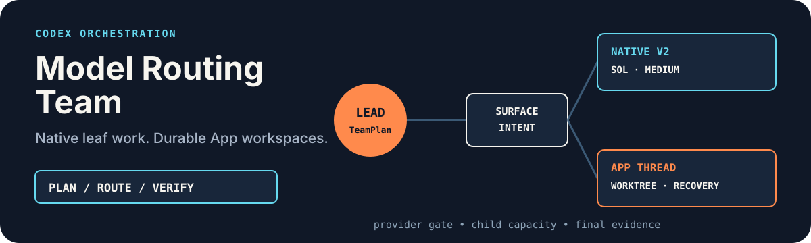

# Codex Model Routing Team

<p align="center">
  
</p>

<p align="center"><strong>The lead owns TeamPlan, file ownership, integration, and verification; ordinary Workers default to native Sol Medium; Luna handles verifiable batches.</strong></p>

<p align="center"><a href="./README.zh-CN.md">简体中文</a> · <a href="https://github.com/zjp1997720/zhijian-skills/tree/main/skills/codex-model-routing-team">Canonical source</a></p>

Use it when parallel execution has a clear net benefit. It compiles work into a lightweight TeamPlan, freezes each unit's surface, model, reasoning, speed, and context scope, then returns integration and final verification to the lead.

## Install

```bash
npx skills add zjp1997720/zhijian-skills
```

For a global Codex installation using copied files:

```bash
npx skills add zjp1997720/zhijian-skills \
  -g -a codex --skill codex-model-routing-team --copy -y
```

Verify the payload:

```bash
npx skills ls -g -a codex
find ~/.agents/skills/codex-model-routing-team -maxdepth 2 -type f | sort
```

## Requirements

- Codex native Multi-Agent V2, Codex App thread tools, or both.
- A live schema that confirms the exact model, reasoning, context, and optional speed fields in each RoutePlan.
- Provider terms, credential paths, and project data boundaries that allow every candidate.

## Activate it

Invoke it directly:

```text
Use $codex-model-routing-team to research these six independent topics in parallel, then verify the synthesis.
```

To allow automatic activation, add this block to a user- or project-level `AGENTS.md`:

```markdown
## Codex background model-routing authorization

- Automatically use `$codex-model-routing-team` when work can be split into at least two independent deliverables with positive net parallel benefit. Brief the Worker count, surface, model, reasoning, speed, and responsibility before dispatch.
- Compile a lightweight TeamPlan before creating two or more Workers. Compile existing upstream plans instead of rewriting them. The lead keeps its model and owns file ownership, integration, and verification.
- Default to native Sol Medium. Use Sol High/XHigh for complex or high-risk work and Luna XHigh for mechanically verifiable batches. App threads require host authorization and a genuine durable-workspace need.
- Workers may not use Ultra, delegate again, or perform irreversible external actions. Reserve live collaboration capacity for the coordinator.
```

## Historical v3 migration

OpenAI Codex added V2 leaf-model support in [PR #36892](https://github.com/openai/codex/pull/36892) and [rust-v0.147.0](https://github.com/openai/codex/releases/tag/rust-v0.147.0). A V2 parent can now create picker-visible, non-disabled leaf models. Luna remains a leaf and cannot collaborate further, but it can execute native V2 Worker units.

The original v3 release changed the default from Luna App threads to native Luna leaf Workers. The current workload policy uses Sol Medium for ordinary execution and Luna XHigh for verifiable batches. App threads remain the right surface for worktrees, sidebar visibility, cross-task recovery, and durable supervision. The Skill deliberately does not add `model: luna` frontmatter because the orchestrator must remain on a collaboration-capable parent model.

## What it does

- Uses a net-benefit gate; the lead executes directly without two independent, verifiable deliverables.
- Validates TeamPlan dependencies, same-wave write conflicts, attempts, reserved slots, and integration order.
- Uses RoutePlan v3 to distinguish `parent_integrated` from `durable_app`; native candidates declare `fork_turns`.
- Defaults to native Sol Medium Standard and raises complex/high-risk units to Sol High/XHigh. Fast requires live `service_tier=priority` evidence.
- Releases native results through live close or confirmed completed-idle state; App threads retain pending, UNKNOWN, recovery, and archive gates.
- Keeps Terra explicit-first-only, Grok preflight-gated, and the current Gemini Antigravity path blocked.
- Keeps publishing, sending, payment, deletion, account, and production mutations in the lead task.

## How it works

1. The lead checks net parallel benefit, then compiles and validates TeamPlan.
2. Each unit receives one Task Packet and one `schema_version: "3.0"` RoutePlan.
3. Ordinary work uses `surface_intent=parent_integrated` and native Sol Medium; host-authorized durable workspace work uses `durable_app`.
4. Native fresh context uses `fork_turns="none"`; a positive string inherits the last N turns. Explicit model overrides reject `all`.
5. Failures advance only through the predeclared chain. The lead verifies real artifacts in integration order.

The lightweight path leaves no coordination files:

```bash
printf '%s' "$TEAM_PLAN_JSON" | python3 scripts/validate_team_plan.py -
printf '%s' "$ROUTE_PLAN_JSON" | python3 scripts/validate_route_plan.py -
printf '%s' "$TEAM_LEDGER_JSON" | python3 scripts/validate_team_ledger.py -
```

## Example requests

```text
Use $codex-model-routing-team to implement, test, and review three independent modules without overlapping file ownership.
```

```text
Use native Sol XHigh to audit three high-risk modules; use an App task only when explicitly authorized by the host and allowed by the project.
```

```text
Use $codex-model-routing-team as the routing orchestrator for $deep-research while preserving verifier and reviewer stages.
```

## Safety and limitations

- Sol Medium is the general baseline; complex/high-risk work uses High/XHigh. Luna retains its XHigh floor for low-risk batches; Ultra is forbidden.
- Picker or catalog eligibility is not live runtime evidence. Do not dispatch an unconfirmed tuple.
- Standard native evidence does not invent speed or service-tier fields; only Fast binds priority evidence.
- RoutePlan v2.1 is completion-only compatibility. All new plans use v3.
- Durable App fallback remains on the App surface so worktree and recovery semantics are preserved.

## Validation

Deterministic tests cover Sol Medium, risk-based escalation, the stdin compiler, App authorization, native Luna, leaf boundaries, fork scope, the Fast live gate, durable App routing, RELEASED lifecycle, TeamPlan profiles, Provider gates, pending/UNKNOWN recovery, and isolated installation.

## License

[MIT](../../../skills/codex-model-routing-team/LICENSE)

## Route compiler / 路由编译器

```bash
python3 scripts/compile_route_plan.py - < request.json
```

Pass workload, risk, Provider boundaries and current live capability evidence. The compiler returns a validated RoutePlan and dispatch arguments; it never creates a Worker. See the [input contract](../../../skills/codex-model-routing-team/references/route-compiler.md). No measured speed or cost advantage over Luna is claimed.
