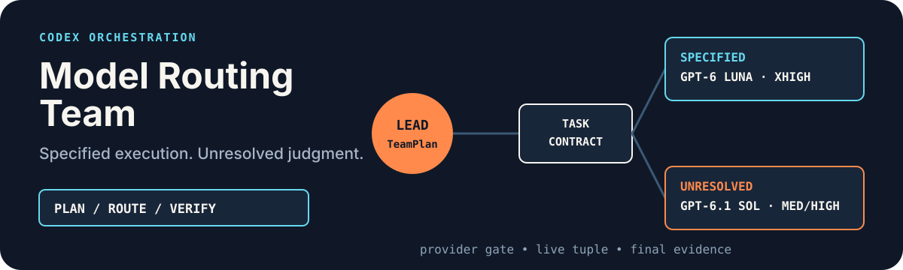

# Codex 模型路由团队

<p align="center">
  
</p>

<p align="center"><strong>把独立工作编译成可验收的叶子 Worker：已定执行交给 GPT-6 Luna，未决判断交给 GPT-6.1 Sol。</strong></p>

<p align="center"><a href="./README.md">English</a> · <a href="https://github.com/zjp1997720/zhijian-skills/tree/main/skills/codex-model-routing-team">统一源码</a></p>

仅在任务包含至少两个独立、可验收交付物，并行净收益高于协调成本时使用。主 Agent 保持当前模型，负责计划、文件所有权、集成和最终验收。

## 安装

```bash
npx skills add zjp1997720/zhijian-skills
```

全局复制安装到 Codex：

```bash
npx skills add zjp1997720/zhijian-skills \
  -g -a codex --skill codex-model-routing-team --copy -y
```

## 环境要求

- Codex 原生 Multi-Agent V2，或 Codex App Thread 工具，或两者。
- 派遣前，live schema 能接受精确的模型、推理强度、上下文和可选速度组合。
- Provider 条款、凭证和项目数据边界允许对应候选。
- 用户点名实验性 CLI 精确模型时，必须取得当前 CLI help 和模型目录证据。

## 启用

```text
使用 $codex-model-routing-team 分别实现和测试这三个独立模块，最后统一集成验收。
```

需要自动触发时，可把以下授权放进 `AGENTS.md`：

```markdown
## Codex 模型路由授权

- 只有任务至少包含两个独立、可验收交付物，且并行净收益为正时，才自动使用 `$codex-model-routing-team`。
- 派遣前简报 Worker 数、Surface、模型、强度、速度和职责。主 Agent 保持当前模型，负责集成和最终验收。
- 每条自动路由先声明 `task_contract`：决策是否已定、什么证据算验收通过。
- 已定执行默认 GPT-6 Luna XHigh，复杂已定执行用 Luna Max；未决判断用 GPT-6.1 Sol Medium/High，高风险用 Sol High，关键独立审查用 Sol XHigh。
- Worker 只能做叶子执行：禁止 Ultra、继续派生、发布、发送、付款、删除、账户和生产变更。
```

## 主要能力

- 净收益门：简单任务或强顺序任务由主 Agent 直接完成。
- TeamPlan：两个以上 Worker 时，校验依赖、所有权、预算、同波写冲突和集成顺序。
- `task_contract`：自动选模前必须明确决策状态和验收证据；提示词长、文件多不单独触发强模型。
- 模型分工：已定执行走 GPT-6 Luna XHigh/Max；未决、高风险和关键判断走 GPT-6.1 Sol Medium/High/XHigh。
- 边界模型：GPT-6 Astra 仅显式使用，Terra 仅显式首项，Grok 需过预检，Gemini 3.6 blocked；DeepSeek 4.1/Gemini 3.8 只走显式手动 CLI。
- 耐久任务：worktree、侧栏、跨任务恢复、耐久监督或预声明 fallback 才进入 App Thread。
- 审计 requested、accepted、observed 三种模型与速度身份，不把请求值冒充运行事实。

## 工作方式

1. 主 Agent 确认独立单元并写清验收证据。
2. 两个以上 Worker 先校验 TeamPlan；依赖环、同波写冲突、超预算和下放最终验收都会被拒绝。
3. `prepare_native_team.py` 可一次生成已校验的原生派遣参数和初始账本，但不会创建 Worker。
4. 每个 Worker 获得唯一 task ID、精确所有权、一份 RoutePlan；每单元最多两次 attempt 和一次 follow-up。
5. Native 结果按 live close 或已确认 completed-idle 释放；App Thread 保留 pending、UNKNOWN、恢复和归档门。
6. 主 Agent 按顺序检查真实产物、完成集成，并校验最终账本。

```bash
python3 scripts/prepare_native_team.py --help
printf '%s' "$TEAM_PLAN_JSON" | python3 scripts/validate_team_plan.py -
printf '%s' "$ROUTE_PLAN_JSON" | python3 scripts/validate_route_plan.py -
printf '%s' "$TEAM_LEDGER_JSON" | python3 scripts/validate_team_ledger.py -
```

## 示例

```text
使用 $codex-model-routing-team。接口已经定稿：给三个 GPT-6 Luna XHigh Worker 分配互不重叠的模块，最后运行验收套件。
```

```text
先用 GPT-6.1 Sol High 解决两个架构未决问题；主 Agent 采纳决定前不要开始实现。
```

```text
我明确要用 DeepSeek 4.1 Flash 做一次只读对比。先核对当前 CLI 模型目录，再用 fresh context 执行。
```

## 安全与限制

- Luna 必须有已定决策和具体验收证据，不能承担高风险或关键独立审查。
- Sol 不低于 Medium，Luna 不低于 XHigh，禁止 Ultra。
- catalog 可见不等于 live runtime 支持；无法确认精确 tuple 时不得派遣。
- Fast 等于 `service_tier=priority`；live schema 没有该字段时保持 Standard。
- 精确 CLI 路由仅限显式、只读、fresh context 和非自动路径，不能替代 Native/App 生命周期证据。
- 没有同任务对照，不宣称更快或更省钱。

## 验证

本次发布运行 82 项路由测试，覆盖 task contract、Luna/Sol 准入、原生快速准备、CLI 精确模型边界、Provider 门、live tuple、速度、TeamPlan 所有权、attempt、生命周期、恢复和隔离安装。

## 许可证

[MIT](../../../skills/codex-model-routing-team/LICENSE)
