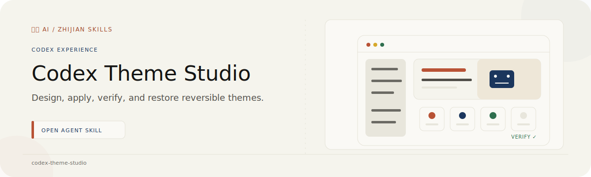

# Codex Theme Studio

<p align="center">
  
</p>

<p align="center"><strong>Turn a brand system and optional ImageGen artwork into a reversible, verified theme for Codex Desktop on macOS.</strong></p>

<p align="center"><a href="./README.zh-CN.md">简体中文</a> · <a href="https://github.com/zjp1997720/zhijian-skills/tree/main/skills/codex-theme-studio">Canonical source</a></p>

Use it when you want more than a palette export: a branded Codex skin, a responsive homepage Banner, an intentional task-page background, repairs to an injected theme, or a reliable path back to the original appearance.

This project is inspired by [Fei-Away/Codex-Dream-Skin](https://github.com/Fei-Away/Codex-Dream-Skin). It turns that upstream idea into a reusable workflow for design, ImageGen artwork, injection, verification, and rollback.

## Install

```bash
npx skills add zjp1997720/zhijian-skills \
  -g -a codex --skill codex-theme-studio --copy -y
```

Then invoke `$codex-theme-studio` and provide the best available brand guide, current `codex-theme-v1:` export, annotated screenshots, and visual assets.

## What It Delivers

- A self-contained theme directory with local assets and validated `theme.json`.
- Brand tokens for surfaces, text, accent, selection, borders, typography, and art placement.
- Optional Banner or background creation through Codex's built-in `$imagegen` Skill.
- Loopback-only CSS and renderer injection without changing the signed app bundle or `app.asar`.
- Immutable base-theme and pre-upgrade backups, plus pause, restore, and version-rollback commands.
- Strict checks for home, task, New Task transition, native tabs, suggestion cards, controls, overflow, and expected artwork.

The bundled neutral warm-paper Banner keeps the workflow usable when ImageGen is unavailable. Image generation is an optional host capability, not an installation dependency and never an excuse to switch silently to an API-key-based fallback.

## How the Workflow Runs

1. Read the brand source and separate native Codex behavior from theme-owned styling.
2. Generate or prepare artwork only when the design needs it; keep accepted images inside the theme package.
3. Build and dry-check the theme outside the installed Skill.
4. Install without launching. Restart an already-running Codex app only after explicit authorization.
5. Verify the homepage, task route, and transient New Task state; repair one defect class at a time.
6. Hand off source assets, evidence, backup location, and exact recovery commands.

## Safety Model

The runtime supports the official macOS Codex app (`com.openai.codex`) only. It verifies app identity, binds Chrome DevTools Protocol to `127.0.0.1`, rejects foreign targets, validates asset paths and sizes, preserves native theme keys, and performs atomic runtime/theme exchanges.

It does not modify the application bundle, authentication, repositories, or conversations. Design and installation permission do not grant permission to stop a running app.

See the [safety and rollback contract](https://github.com/zjp1997720/zhijian-skills/blob/main/skills/codex-theme-studio/references/safety-and-rollback.md) and [verification contract](https://github.com/zjp1997720/zhijian-skills/blob/main/skills/codex-theme-studio/references/verification-contract.md).

## Requirements

- macOS with the official Codex Desktop app
- Node.js 20+
- Bash and standard macOS command-line tools
- Optional built-in ImageGen capability for new raster artwork

The theme runtime requires no API key and makes no outbound internet request. Its only live network surface is the local DevTools endpoint.

## Development

```bash
bash skills/codex-theme-studio/tests/run-tests.sh
node skills/codex-theme-studio/scripts/injector.mjs --check-payload
```

Live doctor checks are intentionally separate because they depend on a local Codex installation.

## Provenance and License

The project is inspired by the MIT-licensed [`Fei-Away/Codex-Dream-Skin`](https://github.com/Fei-Away/Codex-Dream-Skin), and its injection architecture evolved from that project. The Skill adds generalized theme contracts, optional ImageGen assets, signature and loopback validation, immutable backups, responsive route repair, and public packaging. See the bundled `NOTICE.md`, `UPSTREAM_COMMIT`, and `LICENSE`.

Codex and OpenAI are trademarks of their respective owners. This community project is unofficial and is not endorsed by OpenAI or the upstream project.
