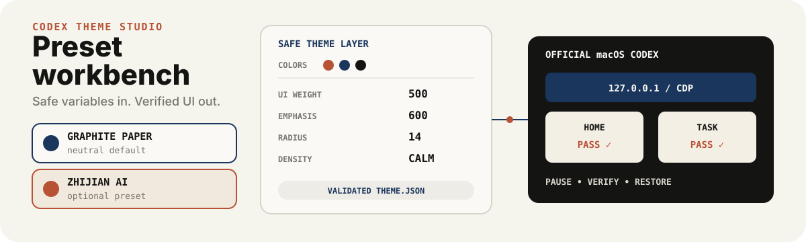

# Codex Theme Studio

<p align="center">
  
</p>

<p align="center"><strong>不修改签名应用包，也能设计、应用、验证并恢复 macOS Codex 自定义皮肤。</strong></p>

<p align="center"><a href="./README.md">English</a> · <a href="https://github.com/zjp1997720/zhijian-skills/tree/main/skills/codex-theme-studio">统一源码</a></p>

Codex Theme Studio 把颜色、字体、本地图片、间距和品牌规范编译成一套可移植主题，并保留经过测试的恢复链路。它提供中性公开默认预设，也把“智见 AI”作为独立可选预设；会改变结构的布局调整则放在明确触发的高级模式中。

## 安装

```bash
npx skills add zjp1997720/zhijian-skills \
  -g -a codex --skill codex-theme-studio --copy -y
```

安装后可以这样说：

```text
使用 $codex-theme-studio 为官方 macOS Codex 设计一套暖纸主题。先生成并验证主题，不要重启 Codex。
```

## 环境要求

- macOS 与官方 Codex Desktop（`com.openai.codex`）
- Codex 或兼容 Agent Skills 的宿主
- Bash 和 macOS 标准命令行工具
- 需要新建位图时，可选使用 Codex 内置 `$imagegen`

运行时会验证并使用 Codex 应用内已签名的 Node.js；开发测试要求 Node.js 20 或更高版本。

## 能做什么

- 校验颜色、UI 与代码字体、正文/重点/代码字重、本地图片、圆角、密度和选中态。
- 内置无品牌默认预设 `graphite-paper`，使用抽象工作流图片。
- 将 `zhijian-ai` 作为独立可选预设，并使用单独的图片授权；它不会混进通用默认主题。
- 从用户明确提供的图片创建新主题，不覆盖 Skill 自带资产。
- 只通过本机回环 Chrome DevTools Protocol 注入 CSS 和渲染辅助代码，不修改 `app.asar`。
- 保留原生交互、焦点、滚动、键盘路径和点击区域。
- 保存不可变的原始主题与升级前备份，提供暂停、恢复和上一版本回退命令。
- 在报告成功前检查首页、任务页、New Task 瞬时状态、普通窗口和全屏状态。

## 工作原理

1. 先把任务判断为设计、应用、验证/修复或暂停/恢复。
2. 默认只进入安全主题层。只有用户明确要求调整宽度、位置、排列或响应式结构时，才进入高级布局和兼容性诊断。
3. 修改已安装运行时前，先校验主题目录并运行确定性测试。
4. 默认只安装、不启动。停止并重启正在运行的 Codex 需要单独授权；常驻续载需要再次明确授权。
5. 应用后运行 Doctor 和实时 Verify，检查页面截图；验证合同失败时先恢复再报告。

主题工作台只接受经过约束的主题变量与本地位图，不执行任意用户 JavaScript，也不会用截图覆盖真实界面。

## 示例请求

```text
使用 $codex-theme-studio 列出内置预设并准备 graphite-paper，不应用，也不重启。
```

```text
使用 $codex-theme-studio 导入 zhijian-ai 预设，只安装不启动，然后等待我明确授权重启。
```

```text
使用 $codex-theme-studio 排查 Codex 更新后对话字体失效的问题。核验稳定语义标记，实时检查失败时恢复官方外观。
```

## 安全与限制

- 只支持官方 macOS Codex。Windows、Linux、ChatGPT 网页版、ZCode、豆包工作、非官方包和其他 Electron 应用不在范围内。
- 不修改应用包、`app.asar`、代码签名、账号、对话、项目和认证数据。
- CDP 只监听 `127.0.0.1`；修改前校验应用身份、renderer 身份、端口归属、图片路径、文件大小和备份。
- 设计或安装授权不等于停止 Codex 的授权。常驻管理器默认关闭，也不能重新打开用户主动退出的 Codex。
- 兼容性只按证据声明，不承诺“所有版本通用”。第二台全新 Mac 的端到端验收和未来 Codex 版本仍属于明确缺失的证据。

完整说明见[能力边界](https://github.com/zjp1997720/zhijian-skills/blob/main/skills/codex-theme-studio/references/capability-boundary.md)、[验证合同](https://github.com/zjp1997720/zhijian-skills/blob/main/skills/codex-theme-studio/references/verification-contract.md)与[信任基线](https://github.com/zjp1997720/zhijian-skills/blob/main/skills/codex-theme-studio/security/trust-baseline.md)。

## 开发验证

```bash
bash skills/codex-theme-studio/tests/run-tests.sh
/Applications/ChatGPT.app/Contents/Resources/cua_node/bin/node \
  skills/codex-theme-studio/scripts/injector.mjs --check-payload
```

实时 Doctor 和截图检查需要本机已安装且获得授权的 Codex 会话，因此与跨平台确定性测试分开执行。

## 协议

软件采用 MIT 协议，并保留对 MIT 项目 [`Fei-Away/Codex-Dream-Skin`](https://github.com/Fei-Away/Codex-Dream-Skin) 的署名；本实现的注入架构受该项目启发并在其基础上演进。

`zhijian-ai` 图片使用 `NOTICE.md` 中的单独限制性授权：允许作为本 Skill 的 Codex 预设使用，不允许拆出转售、换牌、冒充原创或用于无关商业产品。Codex 与 OpenAI 是其各自权利人的商标。本项目是非官方社区项目，未获得 OpenAI 背书。
