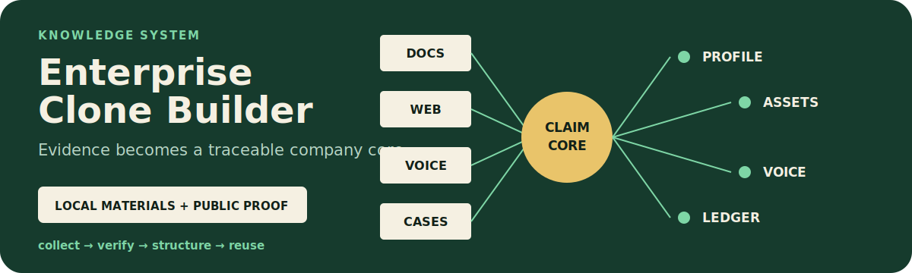

# Enterprise Clone Builder

<p align="center">
  
</p>

<p align="center"><strong>以企业本地资料为主、公开信息为补充，构建结构清晰、来源可追溯的企业数字分身仓库。</strong></p>

<p align="center"><a href="./README.md">English</a> · <a href="https://github.com/zjp1997720/zhijian-skills/tree/main/skills/enterprise-clone-builder">统一源码</a></p>

适合需要把企业散落资料整理为可复用、可追溯知识仓库的专业交付团队。

## Agent 安装

```bash
npx skills add zjp1997720/zhijian-skills -g -a codex --skill enterprise-clone-builder -y
```

## 它做什么

输入企业名称、本地资料和可选官网地址，输出一个标准化企业分身仓库：

```text
{企业名称}-企业分身/
  AGENTS.md                        # 身份、规则与读取路径
  00-企业概览.md                    # 一页纸速查
  01-企业画像/                      # 五个维度的企业画像
  02-原始素材/                      # 本地与公开素材归档
  03-内容资产/                      # 四类结构化内容资产
  04-文风样本/                      # 文风锚点与表达线索
  05-调研记录/                      # 事实账本、缺口与调研过程
  06-产出/                          # 下游写作与交付目录
```

下游写作 Skill 可以直接读取这套仓库，基于企业事实、内容资产和真实文风生成文章、产品介绍及其他内容。

## 为什么需要它

企业数字分身的质量上限取决于材料质量。产品手册、历史文章、客户案例和销售资料通常保存在企业内部，公开信息只适合补足缺口。

这个 Skill 面向为客户搭建企业分身的交付人员。它把资料盘点、补充调研、结构化提取、文风分析和建库固化成一套可重复执行的生产流程。

## 五个阶段

| 阶段 | 产出 |
| --- | --- |
| **Step 0** | 扫描本地资料，按 7 类归档并诊断覆盖缺口 |
| **Step 1** | 只针对缺口补充官网和第三方公开资料 |
| **Step 2** | 提取 5 维企业画像与 4 类内容资产 |
| **Step 3** | 从已发布内容中蒸馏文风锚点、表达线索和禁用表达 |
| **Step 4** | 生成 `AGENTS.md`、企业概览、事实账本、缺口报告和来源地图 |

## 核心原则

1. **本地资料优先**：企业自有材料是主证据，联网调研只补缺口。
2. **结构保持一致**：所有企业分身使用相同目录约定，方便后续复用。
3. **来源可追溯**：事实写明来源，证据与推断明确分开。
4. **缺口透明**：缺失信息和低置信度判断直接标记。
5. **默认面向专业交付**：流程主动推进，同时保留可选的分段确认模式。

## 客户资料清单

Skill 内置 7 类资料清单，可在建库前直接发给客户：企业介绍、产品资料、客户案例、已发布内容、销售话术、行业知识和品牌视觉。

客户按类别整理文件后，只需把资料目录交给 Agent，即可开始盘点和建库。

## 主要文件

| 文件 | 用途 |
| --- | --- |
| `SKILL.md` | 五阶段工作流、输入、输出与完成标准 |
| `references/directory-spec.md` | 标准目录结构 |
| `references/local-intake-guide.md` | 本地资料分类规则与客户清单 |
| `references/extraction-guide.md` | 结构化提取规范 |
| `references/voice-analysis-guide.md` | 文风分析操作指南 |
| `references/web-clipper-usage.md` | 联网资料采集说明 |

## 兼容性

适用于能够读取 `SKILL.md` 并执行文件操作的 Agent Harness，包括 Codex、Claude Code、OpenCode 等。

## 许可证

MIT
