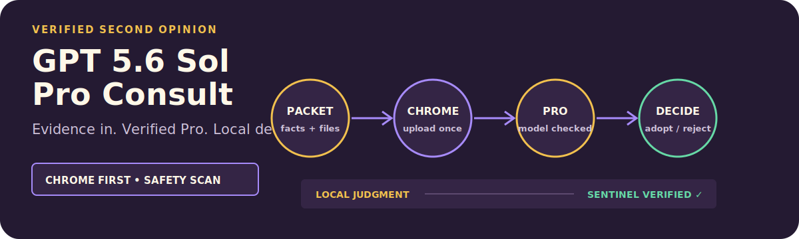

# GPT 5.6 Sol Pro Consult

<p align="center">
  
</p>

<p align="center"><strong>Get a file-grounded, model-verified second opinion from GPT 5.6 Sol Pro through Codex Chrome.</strong></p>

<p align="center"><a href="./README.zh-CN.md">简体中文</a> · <a href="https://github.com/zjp1997720/zhijian-skills/tree/main/skills/gpt56-sol-pro-consult">Canonical source</a></p>

Use it when a difficult decision deserves an outside challenge grounded in the actual files. OpenCLI is an optional fallback, not an installation requirement.

## Install

```bash
npx skills add zjp1997720/zhijian-skills \
  --global --agent codex --skill gpt56-sol-pro-consult --yes
```

## Requirements

- Codex with the Chrome plugin connected
- A Chrome profile signed in to ChatGPT
- A ChatGPT account whose model picker exposes `Pro`
- Python 3.10 or newer for the bundled scanners and tests
- OpenCLI only if you explicitly want the fallback route

## What it does

- Builds a structured context packet from the decision, evidence, constraints, local judgment, risks, and unknowns.
- Uses Codex Chrome by default for text entry, model selection, attachments, waiting, and response extraction.
- Verifies that the picker shows the GPT-5.6 Sol family and that the exact `Pro` option is checked before sending.
- Scans packets for credential-like material before external submission.
- Waits for a complete assistant turn and verifies a unique sentinel before treating the consultation as finished.
- Brings the answer back into the local workflow as an adoption decision: adopt, reject, or modify.

## How it works

```text
Local judgment
  -> context packet and real evidence
  -> credential scan
  -> Codex Chrome
  -> verify GPT-5.6 Sol + checked Pro
  -> submit once and wait
  -> extract the complete answer
  -> local verification and final decision
```

The Skill treats the Pro answer as advisory. The local Agent remains responsible for checking the evidence and delivering the final result.

## Example requests

```text
Use GPT 5.6 Sol Pro to challenge this architecture decision. Include the attached source files and bring back the strongest counterargument.
```

```text
I am choosing between four enterprise AI training offers. Form your own view, ask Pro to find the biggest flaw, and merge only the supported advice.
```

```text
Review this local Skill as a complete artifact. Upload the actual relevant files; do not pretend ChatGPT can read local paths.
```

## Safety and limitations

- The consultation sends selected material to ChatGPT Web. Review the evidence set before submission.
- Tokens, cookies, passwords, API keys, private keys, OAuth headers, browser profiles, and session dumps must not be sent.
- ChatGPT cannot read a local path by itself. Upload the file, paste its contents, or build a Markdown bundle.
- The run is incomplete when the model, attachments, completed response, or sentinel cannot be verified.
- OpenCLI supports the optional text-only fallback. Real file uploads use Codex Chrome.

## Package layout

```text
gpt56-sol-pro-consult/
├── SKILL.md
├── agents/openai.yaml
├── evals/evals.json
├── references/
├── scripts/
└── tests/
```

## License

MIT. See the repository-level `LICENSE` file.
