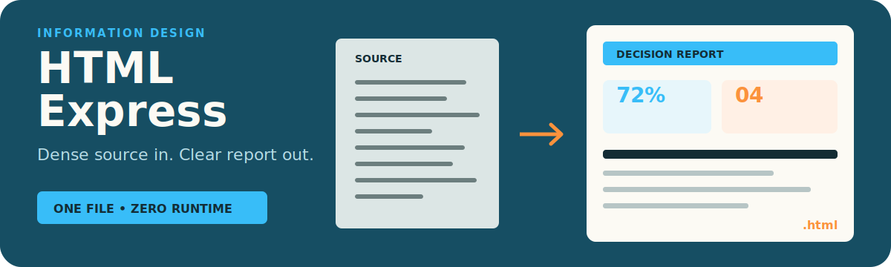

# HTML Express

<p align="center">
  
</p>

<p align="center"><strong>Turn dense information into one clear, self-contained HTML report that opens anywhere.</strong></p>

<p align="center"><a href="./README.zh-CN.md">简体中文</a> · <a href="https://github.com/zjp1997720/zhijian-skills/tree/main/skills/html-express">Canonical source</a></p>

Use it when Markdown would become a wall of text: research reports, comparison matrices, checklists, timelines, data dashboards, decision pages, and visual summaries.

## What It Does

- Picks the right page structure for the information.
- Uses reusable HTML/CSS components.
- Produces a single `.html` file that can be opened locally.
- Keeps CSS inline in the final artifact, so there is no build step or runtime dependency.

## Included Components

The component snippets live in `assets/components/`:

| Component | Use for |
|---|---|
| `metric-card` | Key numbers and status metrics |
| `comparison-table` | Side-by-side option comparison |
| `data-table` | Structured records |
| `timeline` | Milestones, roadmaps, event sequences |
| `checklist` | SOPs, steps, readiness checks |
| `quote-card` | Takeaways and highlighted judgments |
| `code-block` | Commands, config, code |
| `details` | Collapsible long sections |
| `badge` | Status labels |
| `columns` | Parallel views |

## Install

```bash
npx skills add zjp1997720/zhijian-skills -g -a codex --skill html-express -y
```

## Example Requests

```text
Use $html-express to turn this research summary into a one-page HTML report.
```

```text
Make a comparison dashboard for these three options as a self-contained HTML file.
```

```text
Create a timeline + checklist page from these project notes.
```

## Agent Workflow

The full agent-facing workflow is in `SKILL.md`.

Short version:

1. Identify the information shape.
2. Choose 2-5 components.
3. Start from `assets/skeleton.html`.
4. Inline `assets/tokens.css`.
5. Fill real content.
6. Save one `.html` file and verify it locally.

## Design

The default style is Warm Paper: warm background, restrained terracotta accent, trust-blue structure, readable typography, and minimal decoration.

You can replace `assets/tokens.css` to match your own brand while keeping the same component classes.

## Validation

This repository is designed to work with `npx skills`.

Recommended checks:

```bash
python3 ~/.codex/skills/.system/skill-creator/scripts/quick_validate.py .
npx skills add zjp1997720/zhijian-skills --list
```

## License

MIT
