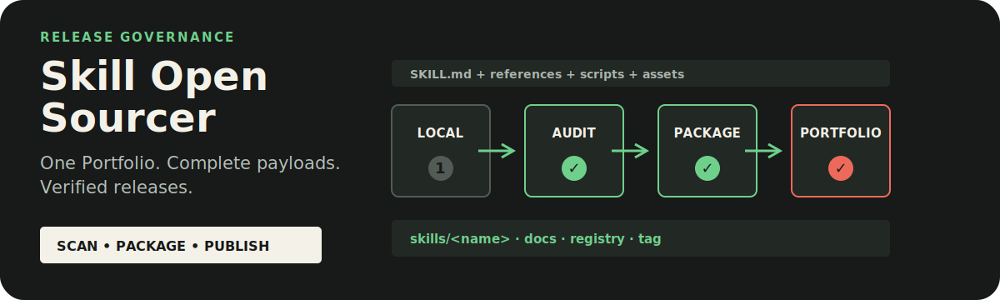

# Skill Open Sourcer

<p align="center">
  
</p>

<p align="center"><strong>Turn a local Agent Skill into a complete, verified release inside Zhijian Skills.</strong></p>

<p align="center"><a href="./README.zh-CN.md">简体中文</a> · <a href="https://github.com/zjp1997720/zhijian-skills/tree/main/skills/skill-open-sourcer">Canonical source</a></p>

Use it when a local Skill is ready to become public and installable. Every release is imported into `zjp1997720/zhijian-skills`; the workflow never creates a standalone Skill repository.

## Install

```bash
npx skills add zjp1997720/zhijian-skills \
  -g -a codex --skill skill-open-sourcer --copy -y
```

Then invoke `$skill-open-sourcer` with a local `SKILL.md` or Skill directory.

## Requirements

- Python 3, Git, Node.js, and `npx`
- A verified local checkout of `zjp1997720/zhijian-skills`
- Authenticated push access to that canonical repository when publication is requested

## What It Does

- Scans the incoming Skill for secrets, personal paths, caches, private data, unsafe links, and unclear assets.
- Imports the complete payload into `skills/<name>/` and creates bilingual docs, Changelog, Registry metadata, and catalog entries.
- Locks an eight-field release story, chooses a clean-doc or proof-led presentation tier, and rejects generic Hero templates shared across unrelated Skills.
- Validates the Skill, full Portfolio, declared tests, README structure and assets, local discovery, and isolated copy installation.
- Audits shared Portfolio README links against an explicit canonical repository boundary.
- Uses top-level CLI help and list-only discovery so a help probe cannot trigger an unintended installation.
- Pushes only the canonical Portfolio and creates only `<skill>/v<version>` Tags.
- Produces the canonical install command and launch copy.

## How It Works

The Skill treats open-sourcing as a governed import into one Portfolio. A direct `SKILL.md` input identifies what to import; it never selects a new-repository mode. README design begins with audience, repeated problem, value, proof, first action, safety boundary, native material, and presentation tier. Proof-led Heroes then receive a unique composition derived from that Skill's real mechanism or output. Publishing fails closed when the canonical remote, source ownership, security scan, package completeness, README evidence, or installation proof is missing.

## Example Requests

```text
Use $skill-open-sourcer to add this local Skill to Zhijian Skills and publish it.
Use $skill-open-sourcer to audit this SKILL.md before importing it into the Portfolio.
Use $skill-open-sourcer to release the next canonical version of this Skill.
```

## Canonical Layout

```text
skills/<name>/          complete agent-facing payload
docs/skills/<name>/     bilingual human documentation
docs/changelogs/        independent release notes
registry/skills.json    version, validation, capabilities, and Harnesses
```

## Safety

The workflow never creates an independent GitHub repository, writes mirror metadata, force-pushes, or rewrites published Tags. README links may resolve inside the explicitly selected canonical repository and nowhere beyond it. Missing evidence remains explicit.

## License

[MIT](../../../LICENSE)
