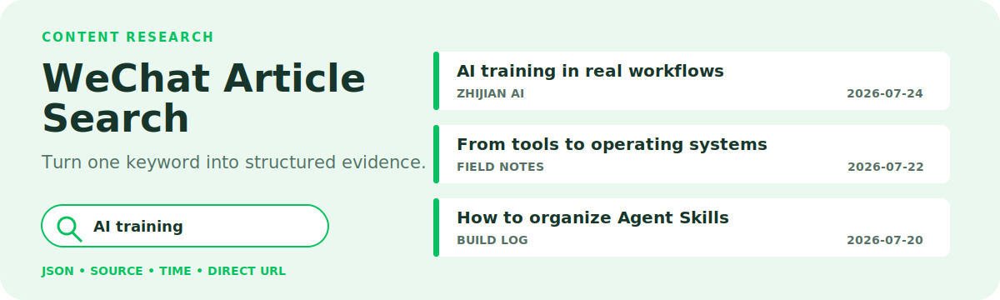

# WeChat Article Search

<p align="center">
  
</p>

<p align="center"><strong>Search WeChat public-account articles by keyword and return structured evidence without an API key.</strong></p>

<p align="center"><a href="./README.zh-CN.md">简体中文</a> · <a href="https://github.com/zjp1997720/zhijian-skills/tree/main/skills/wechat-article-search">Canonical source</a> · <a href="https://github.com/zjp1997720/wechat-article-search">Standalone mirror</a></p>

Use it for topic discovery when you know the keyword but not which WeChat public account published the useful article.

## Agent Install

```bash
npx skills add zjp1997720/wechat-article-search -g -a codex --skill wechat-article-search -y
```

## Requirements

- Node.js 18+ (tested on Node 20)
- One npm dependency: `cheerio`. Run `npm install` inside the skill folder after install.

## What It Does

- **Keyword search** across WeChat public accounts via Sogou WeChat Search — returns 1–50 articles per query.
- **Structured output**: title, URL, summary, publish datetime, date text, relative time, source account name.
- **Optional real-URL resolution** (`-r`): converts Sogou redirect links into `mp.weixin.qq.com` direct links when reachable.
- **Optional file output** (`-o`): writes JSON to disk for archival.

## How It Works

The skill drives a single self-contained Node.js script (`scripts/search_wechat.js`) that queries Sogou WeChat Search (`weixin.sogou.com`), parses the result HTML with `cheerio`, and emits structured JSON to stdout. No API keys, no MCP tools, no platform coupling — it works in any agent runtime that can run `node`.

## Example Requests

```
Search WeChat articles about "Loop Engineering", give me 10.
```

```
搜一下"AI培训"相关的公众号文章，要 5 条，保存到 result.json。
```

## CLI Usage

```bash
node scripts/search_wechat.js "<keyword>" [-n <count>] [-o <output.json>] [-r]
```

| Flag | Default | Description |
|------|---------|-------------|
| `query` | required | Search keyword |
| `-n, --num` | 10 | Number of results (max 50) |
| `-o, --output` | stdout | Write JSON to a file |
| `-r, --resolve-url` | off | Resolve real `mp.weixin.qq.com` URLs (slower, may fail under anti-bot) |

First run: `npm install` in the skill folder to pull `cheerio`.

## Safety & Limits

- Uses public Sogou WeChat Search as the data source. Anti-bot rate limiting can intermittently return empty results or block URL resolution — retry with a different keyword or wait.
- `-r` URL resolution succeeds inconsistently under Sogou's anti-spider policy. Failures keep the Sogou redirect link and set `url_resolved: false`.
- For study and research only. Do not use for large-scale commercial crawling. Excessive use may get your IP temporarily blocked.

## Repository Layout

```text
.
├── README.md
├── README.zh-CN.md
├── assets/readme/hero.svg
├── LICENSE
└── skills/wechat-article-search/
    ├── SKILL.md
    ├── agents/openai.yaml
    ├── package.json
    └── scripts/search_wechat.js
```

## License

MIT
