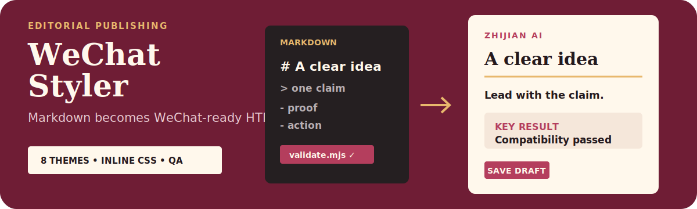

# WeChat Styler · 公众号排版 Skill

<p align="center">
  
</p>

<p align="center"><strong>把 Markdown 一键排成可直接粘进公众号编辑器的内联 HTML：8 套主题、确定性校验、零外部 CSS。</strong></p>

<p align="center"><a href="./README.md">English</a> · <a href="https://github.com/zjp1997720/zhijian-skills/tree/main/skills/wechat-styler">统一源码</a></p>

适合已经完成 Markdown 初稿、需要稳定品牌排版并直接粘贴到公众号编辑器的文章。

## Agent 安装

```bash
npx skills add zjp1997720/zhijian-skills -g -a codex --skill wechat-styler -y
```

任何能加载 `SKILL.md` 的 Agent 运行时都能用（Codex、Claude Code、OpenCode 等）。

## 环境要求

- Node.js 18+
- `marked`、`js-yaml`、`glob`（由 Skill 运行时自动安装，或手动执行 `npm install`）

## 它解决什么问题

- **一次转好，粘贴不丢格式。** 所有样式内联，背景色全部使用 solid hex；从浏览器复制进公众号编辑器后，颜色、对齐和引用块都能保留。
- **8 套主题有真正的版式人格。** `magazine-ink` 是经典杂志内页，`magazine-indigo` 是研究栏加全大写标题，`magazine-forest` 是田野笔记加居中楷体标题。每套主题都有自己的标题结构、引用样式、列表 marker 和代码块。
- **可选组件拓展层（`--components`）。** 6 个结构化组件用于呈现对比、流程和要点。默认关闭；需要结构化呈现时显式启用。组件使用 `section + flex`，避开公众号编辑器会自行加灰边的 `table`。
- **兼容性由脚本把关。** `validate.mjs` 扫描公众号会剥离的内容（`<style>`、`class`、`rgba()`、`position:fixed`、`@media` 等），并输出带行号的报告。转换时自动执行，也能单独用于 CI。
- **占位符机制。** 图床尚未准备好时，在 Markdown 中写 `【插入:文章开头截图】`，即可渲染成虚线占位框；图片就绪后再替换为普通 Markdown 图片链接。

## 怎么工作的

四个部分，各管一件事：

1. **`scripts/convert.mjs`** — 用 `marked` 解析 Markdown，按主题对应的 renderer（6 个 preset 支撑 8 套主题）渲染，输出全内联 HTML。
2. **`scripts/components.mjs`** — 可选组件拓展层，通过 `--components` 启用。
3. **`scripts/validate.mjs`** — 按公众号兼容规则扫描产物（5 类 ERROR + 3 类 WARN）；既作为转换流程的软门，也能独立运行并返回 exit code。
4. **`themes/*.yaml`** — 每个主题一个文件。颜色、字体、字号、间距和版式风格都写在 YAML 中，新增主题无需修改代码。

**一个关键设计选择：主题是 YAML 参数，不是重组件库。** 这样 Skill 保持轻量、跨模型稳定，也方便扩展。当主题需要结构差异时（例如 5 套 magazine 变体），renderer 通过 `magazine_variant` 进入不同分支：同一个脚本，不同版式人格。

## 触发示例

```
用 magazine-ink 主题把这篇文章排成公众号:
$wechat-styler path/to/article.md --theme magazine-ink

批量转换整个目录:
$wechat-styler "articles/*.md" --theme kami

校验已有 HTML 文件:
$wechat-styler 然后运行: node scripts/validate.mjs path/to/output.html
```

## 关于品牌主题

默认主题 `zhijian` 是作者自己的品牌主题（暖纸感 + 陶土行动色 + 墨蓝结构色），由一套完整品牌设计系统派生。它作为**示例**保留，用来展示如何把品牌系统固化进 Skill。

想做成自己的主题，只需复制 `themes/zhijian.yaml`，修改颜色、字体和 `top_label`，再换一个主题名。

## 仓库结构

```text
.
├── README.md
├── README.zh-CN.md
├── assets/readme/hero.svg
├── LICENSE
└── skills/wechat-styler/
    ├── SKILL.md                 # Agent 工作流入口
    ├── agents/openai.yaml       # Agent UI 元数据
    ├── scripts/                 # 转换、组件和兼容校验
    └── themes/                  # 8 套 YAML 主题
```

## 设计立场

- **克制优于装饰。** 主题靠留白、细线和字体分层建立质感，不依赖卡片、缎带或关键词逐段下划线。视觉定位是「安静可信」。
- **兼容性是脚本，不是愿望。** 校验规则对应公众号编辑器真实会剥离或破坏的内容，每次转换都会执行。
- **YAML 主题，不是组件库。** 结构人格放在 renderer 的 variant 分支，表面人格放在 YAML；新增主题无需改动主流程代码。

## 协议

MIT — 见 [LICENSE](../../../skills/wechat-styler/LICENSE)。
