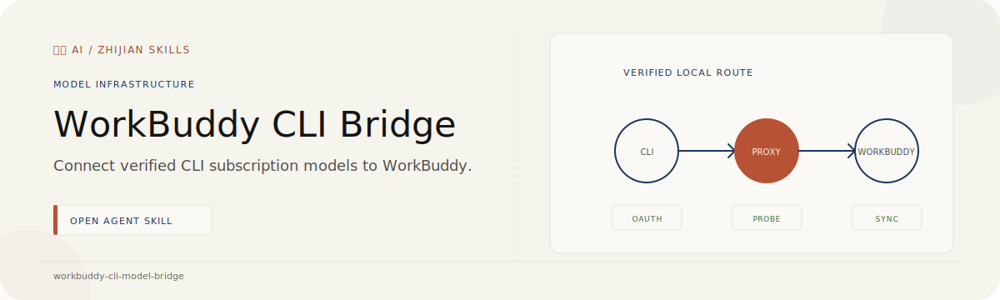

# WorkBuddy CLI Model Bridge

<p align="center">
  
</p>

<p align="center"><strong>Install, authorize, probe, and register CLI subscription models in WorkBuddy without hand-editing credentials.</strong></p>

<p align="center"><a href="./README.zh-CN.md">简体中文</a> · <a href="https://github.com/zjp1997720/zhijian-skills/tree/main/skills/workbuddy-cli-model-bridge">Canonical source</a></p>

Use this Skill when you want Codex, Grok, or Antigravity/Gemini models to appear as WorkBuddy custom models, when an existing local model route stops working, or when you need to onboard another CLI Provider.

## Agent install

```bash
npx skills add zjp1997720/zhijian-skills \
  --skill workbuddy-cli-model-bridge --agent codex --global --copy --yes
```

The install payload also supports Claude Code and generic Agents-compatible Harnesses.

## Requirements

- macOS
- Python 3.11 or newer; runtime code uses only the standard library
- WorkBuddy installed and opened at least once
- Homebrew for a new CLIProxyAPI installation
- an account the user owns for each OAuth Provider

## What it does

- Audits Homebrew, CLIProxyAPI, WorkBuddy, known CLIs, OAuth-file counts, and model availability without reading token contents.
- Installs CLIProxyAPI through its official Homebrew formula on a clean macOS setup.
- Keeps a healthy existing manual or LaunchAgent deployment in place.
- Delegates authentication to CLIProxyAPI's native Codex, xAI, and Antigravity OAuth flows.
- Probes text, streaming, tools, images, and reasoning controls before enabling WorkBuddy capability flags.
- Uses a 256×192 composition with a red square and blue circle for the image probe, so tiny-image ambiguity and merely accepting a multimodal request do not count as verification.
- Backs up and atomically merges models into WorkBuddy while preserving manual entries.
- Loads additional machine-local Provider manifests without modifying the public Skill.

## Quick use

Ask your Agent:

```text
Use $workbuddy-cli-model-bridge to detect my logged-in CLI agents, install or repair CLIProxyAPI, and register every verified recommended model in WorkBuddy.
```

Or run the deterministic stages directly from the installed Skill directory:

```bash
python3 scripts/bridge.py audit
python3 scripts/bridge.py bootstrap --apply
python3 scripts/bridge.py authorize codex
python3 scripts/bridge.py sync --providers codex --apply
```

The OAuth command may open a browser. Approve the Provider grant, then the Agent continues automatically.

## Supported Providers

| Provider | CLI signal | CLIProxyAPI OAuth | Recommended route |
| --- | --- | --- | --- |
| OpenAI Codex | `codex` | `--codex-login` | GPT Sol primary; verified Fast alias when exposed |
| xAI Grok | `grok` | `--xai-login` | Grok primary and optional Fast model |
| Google Antigravity | `antigravity` / `agy` | `--antigravity-login` | Gemini Flash primary |

Provider manifests select from the live `/v1/models` response. Exact current model IDs are preferences with fallbacks; the Skill does not invent unavailable aliases.

Fast entries are registered only when CLIProxyAPI exposes a working Fast alias. For OAuth routes, CLIProxyAPI documents Fast aliases as an `oauth-model-alias` plus a matching `payload` override such as `service_tier: priority`; the bridge never labels an ordinary route as Fast based on its name alone.

## Reasoning visibility

The bridge verifies that the route accepts the configured reasoning control. It cannot expose a Provider's private chain of thought. WorkBuddy may display a Provider-supplied reasoning summary or progress headings; recording a teachable decomposition requires asking the model to produce an explicit step-by-step explanation as normal answer content.

## New Provider workflow

Machine-local Provider manifests live under:

```text
$HOME/.config/workbuddy-cli-model-bridge/providers.d/
```

The onboarding protocol prefers native CLIProxyAPI OAuth, then an official OpenAI-compatible endpoint, then declarative aliases, with a bounded local adapter as the disclosed last resort. Validate every manifest before authorization:

```bash
python3 scripts/bridge.py validate-provider path/to/provider.json
```

See the installed `references/provider-schema.md` and `references/onboarding-new-cli.md` files for the complete contract.

## Safety model

- CLIProxyAPI is explicitly bound to loopback.
- Remote management stays disabled.
- Native CLI tokens are never copied into the proxy.
- The local proxy client key, OAuth files, WorkBuddy config, and credential-bearing backups use owner-only permissions.
- Reports redact keys, tokens, account identifiers, one-time codes, prompts, and images.
- Existing manual WorkBuddy models are preserved; an ID collision blocks that model instead of overwriting it.
- Subscription limits and Provider terms remain in force. The Skill does not implement quota or block evasion.

## Development

```bash
python3 -m unittest discover -s skills/workbuddy-cli-model-bridge/tests -v
python3 skills/workbuddy-cli-model-bridge/scripts/bridge.py \
  validate-provider skills/workbuddy-cli-model-bridge/providers/codex.json
```

The tests use isolated temporary homes and a fake OpenAI-compatible server. They verify manifest safety, key redaction, model selection, manual-entry preservation, capability downgrade, atomic mode, backups, and idempotent repeated sync.

## Upstream references

- [CLIProxyAPI repository](https://github.com/router-for-me/CLIProxyAPI)
- [Official macOS Quick Start](https://help.router-for.me/introduction/quick-start)
- [Configuration options, OAuth aliases, and payload rules](https://help.router-for.me/configuration/options)
- [Codex OAuth](https://help.router-for.me/configuration/provider/codex), [xAI OAuth](https://help.router-for.me/configuration/provider/xai), and [Antigravity OAuth](https://help.router-for.me/configuration/provider/antigravity)

## License

[MIT](../../../skills/workbuddy-cli-model-bridge/LICENSE)
